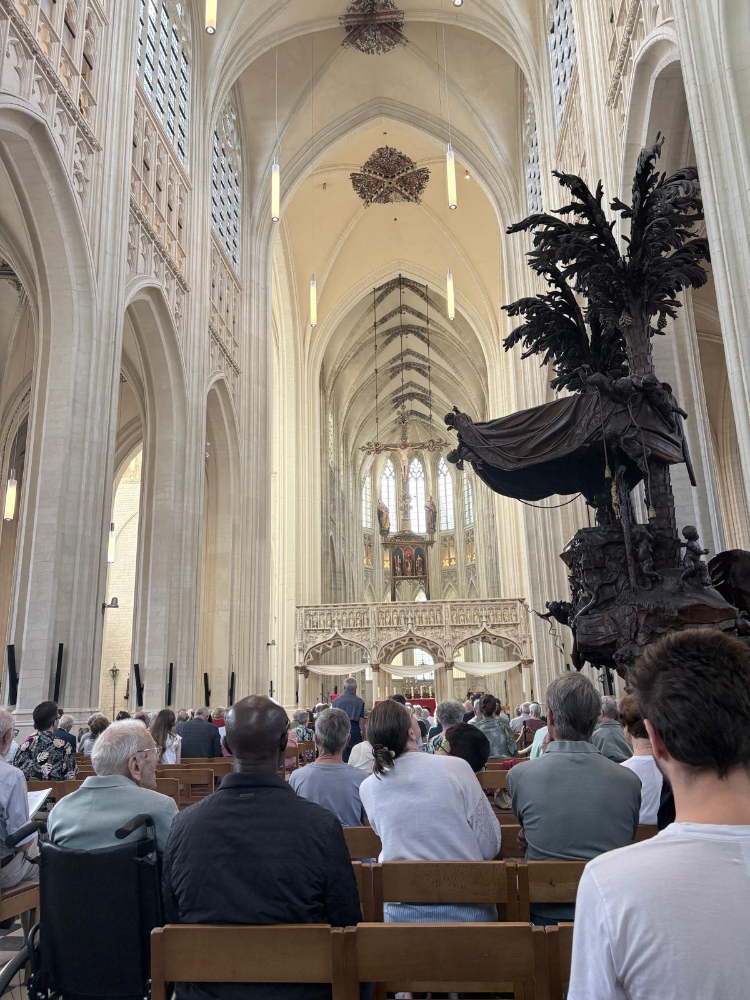
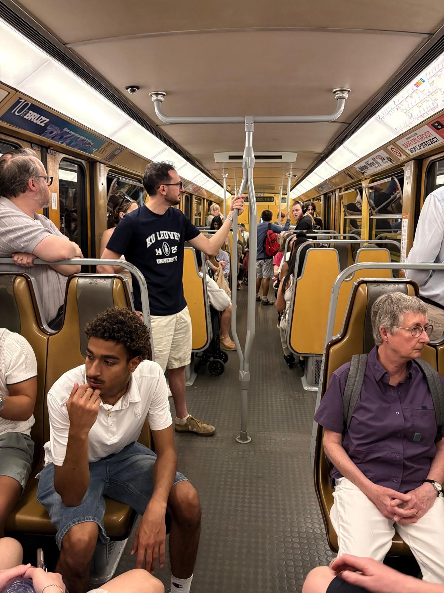
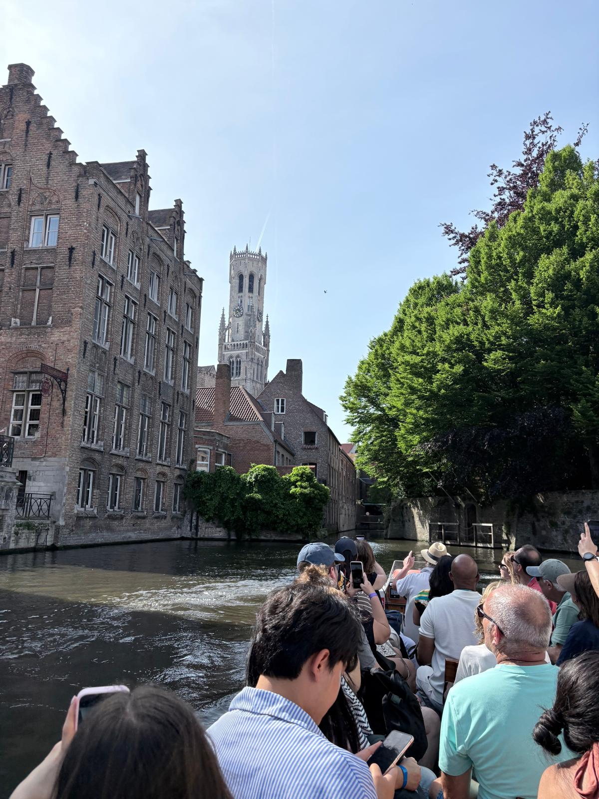
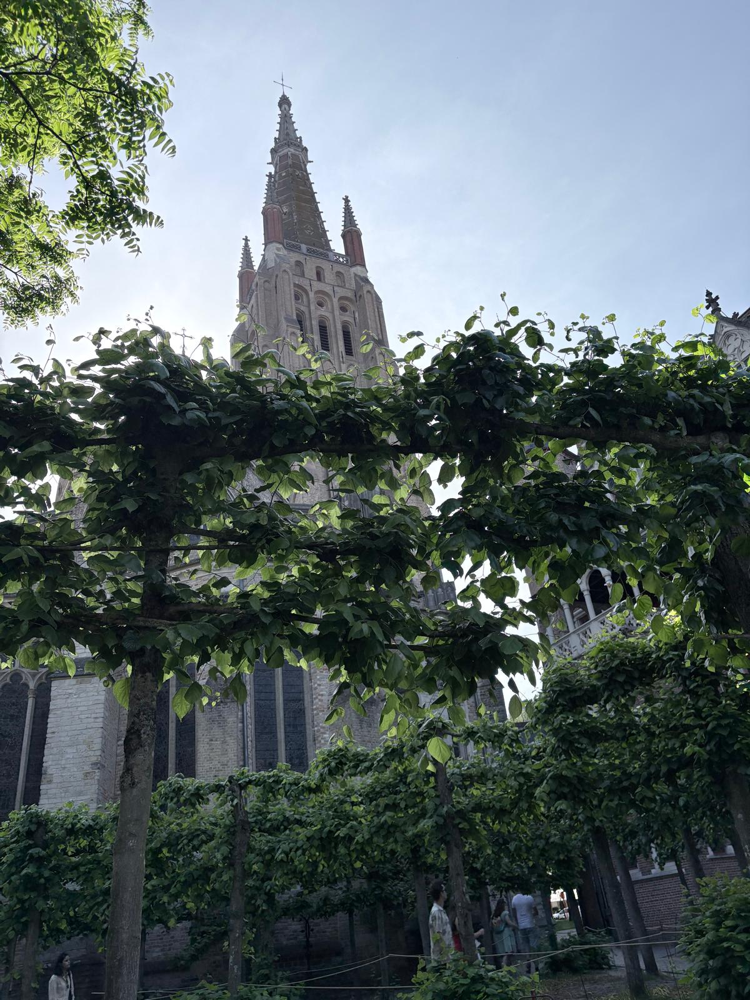

## Phase 2 Contributions

### Data Models

In phase 2, I was the point person with the help of Tyler for creating the Data Models, ER Diagrams, Relational Models, and DDL. We started by theorizing on paper which entities we would need for the functionality of each user persona. I then created scratch ER diagrams and eventually formalized them on LucidCharts. From there, I created Relational Models using DBDesigner. Lastly, I wrote the DDL based on the Global Relational Model. I found it especially interesting to explore how all of the local data models linked and combined into the global data model. Right now, I feel our design is simple and will likely need to be expanded upon in the coming weeks.

### Wireframes

In phase 2, I supported Tyler in creating the Wireframes. We created scratch wireframes in class and theorized which screens we would want to include. From there, Tyler took the responsibility of being the point person on the Wireframes. I supported him with advice and discussion of our planned features. Overall, I am really happy with the outcome and it is exciting to see the project starting to come together.

## Guest Speakers

This week we had a lot of guest speakers about EU governance and the NATO alliance. I found our discussion with Major Serge Strobants from NATO to be especially interesting. We discussed the challenges the NATO alliance is experiencing amidst the tense global political environment. Major Strobants discussed the ways in which Russia is attempting to destabilize the alliance by creating "gray area" conflicts in which it is unclear if Article 5 of the NATO Treaty is applicable. He also discussed how the alliance recently decided to treat cyber attacks as physical attacks which widens the attack surface for these "gray area" attacks.

## Week 2 in Belgium

This week we explored a lot of Leuven, Brussels, and Bruges. From playing basketball with locals at a court near KU Leuven, to taking a boat tour around the canals of Bruges, I feel I have become a lot more comfortable in the country and am having a lot of fun learning about the culture. I also attended Pentecost mass at the cathedral here in Leuven. I found learning about the history of the cathedral to be especially interesting as it has been around since 900 A.D. And while the entire mass was in Dutch, it was cool to see how our traditions span across the world and I was still able to understand what was going on.

*Leuven Cathedral*

*Subway in Brussels*

*Boat Tour in Bruges Canal*

*Cathedral in Bruges*