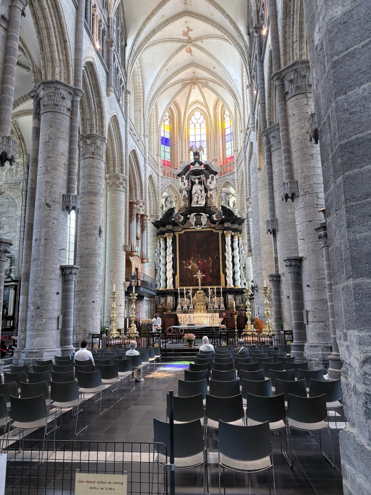
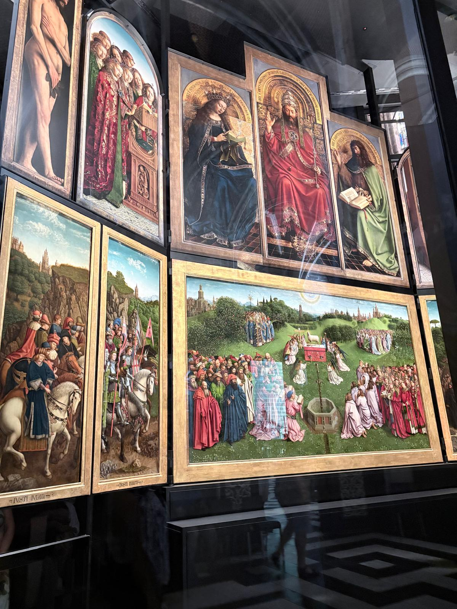
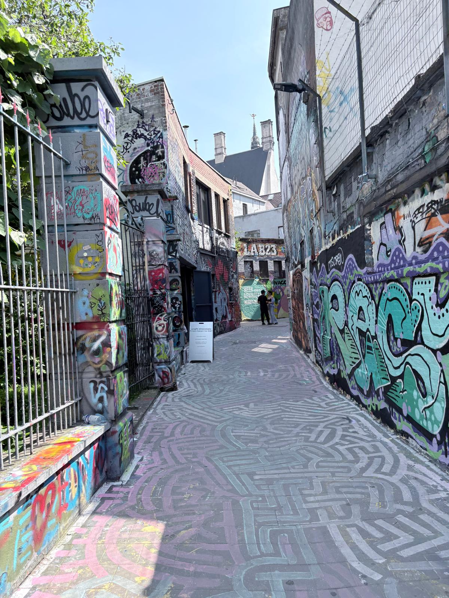
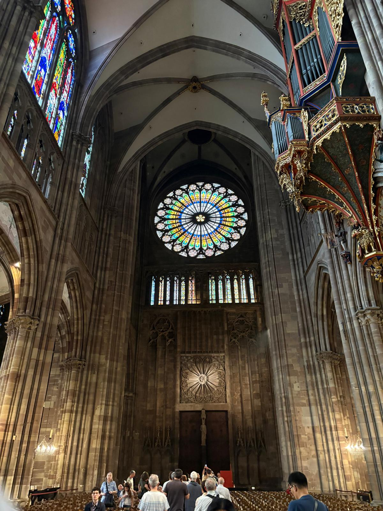
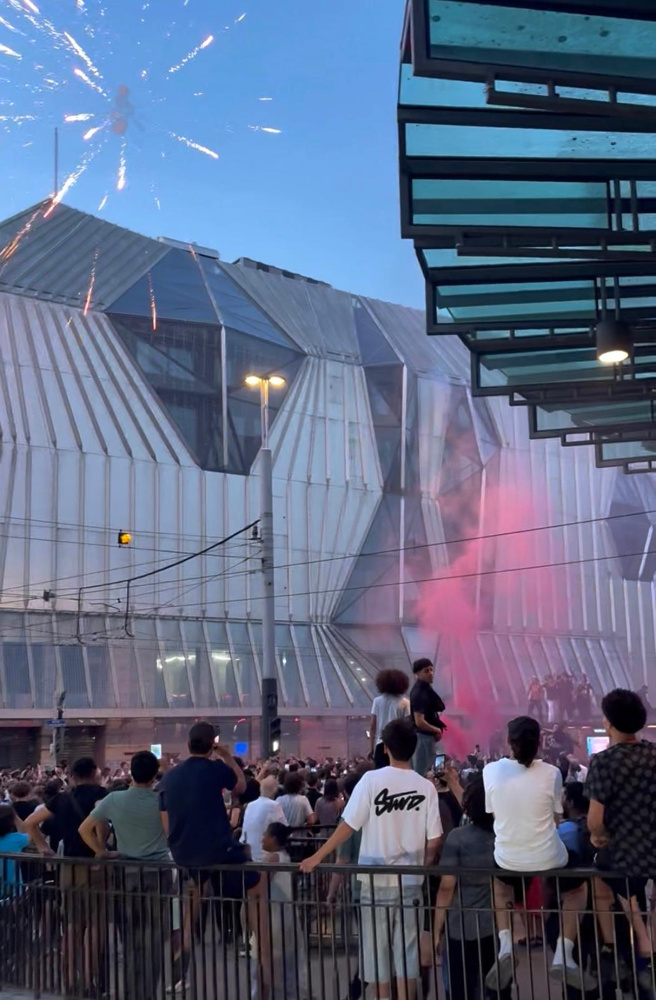
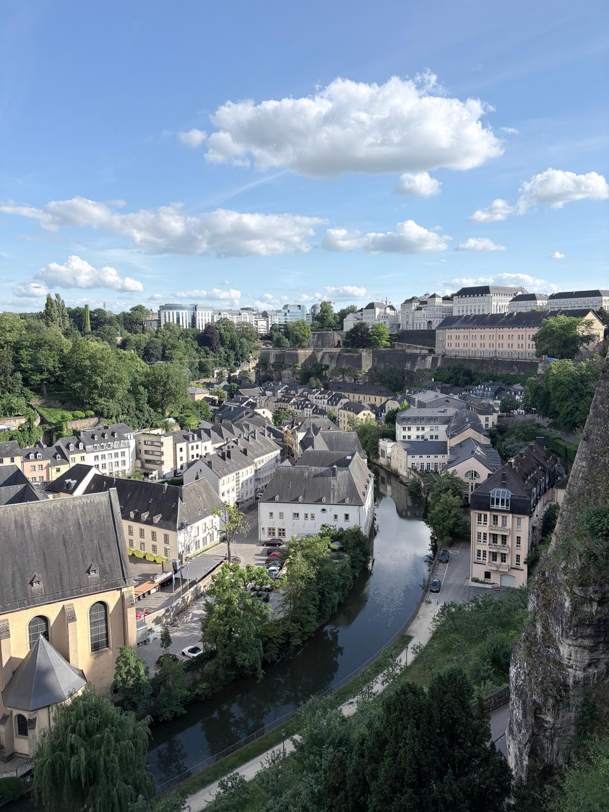

# Week 3 Adventures
This week we explored more of Belgium including Ghent (my favorite Belgian city so far) and took a weekend trip to Strasbourg, France, and Luxembourg. In Ghent, we did a AR tour of St. Bravo's Cathedral which I thought was a very interesting and surprisingly informative way to explore the cathedral's history, and the cathedral itself was one of the most beautiful cathedrals I have visited. The city of Ghent was very pretty and old, looking like what I imagined a Belgian city to look like before the trip.

Later in the week, we visited Strasbourg, France, which was also a very cool and historic city. I enjoyed learning about and experiencing the mix of French and Belgian cultures. This was apparent when I attended mass at the huge Notre Dame Cathedral in the middle of Strasbourg, and the mass was bilingual between French and German. We happened to visit the weekend of the UEFA Final between PSG and Arsenal. Following PSG's exciting shootout win, Strasbourg erupted with celebrations and borderline riots. It was interesting to experience the deep sports culture here which caused such high emotions.

To end off the week, we visited Eurostat in Luxembourg. For our project, we are planning on getting most of our data, so it was very interesting to learn about the process for surveying citizens, cleaning data, and making it available to the public. While we were only in Luxembourg for an evening, we were able to explore the beautiful historic sector of the city and visit a stunning lookout over the surrounding valley.

*St. Bravo's Cathedral in Ghent*

*Adoration of the Mystic Lamb painting in Ghent*

*Graffiti Alley in Ghent*

*Notre Dame Cathedral in Strasbourg*

*Strasbourg celebrations after PSG win*

*Viewpoint in Luxembourg*
