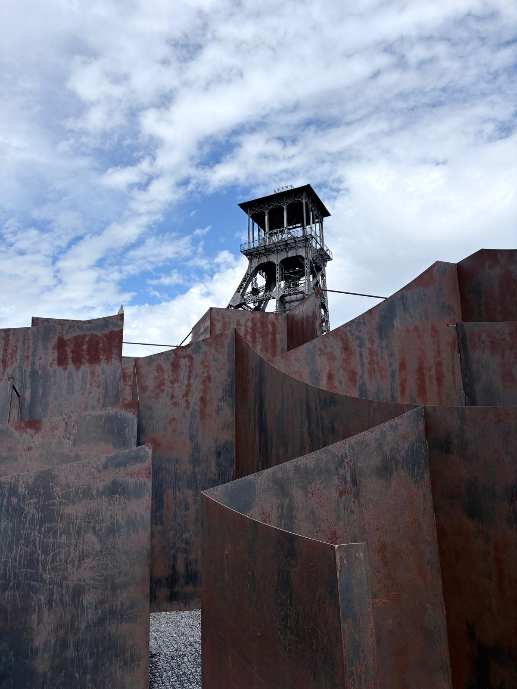
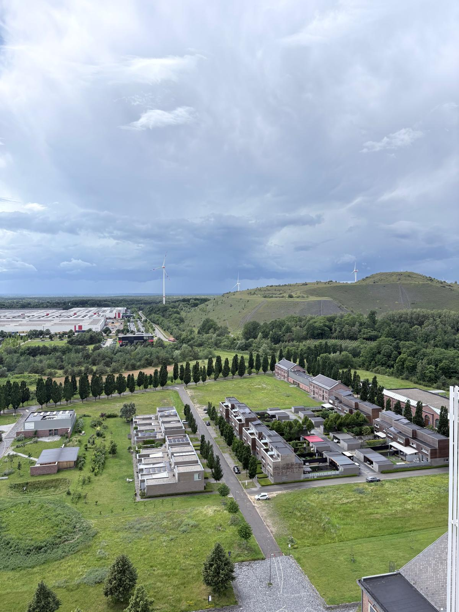
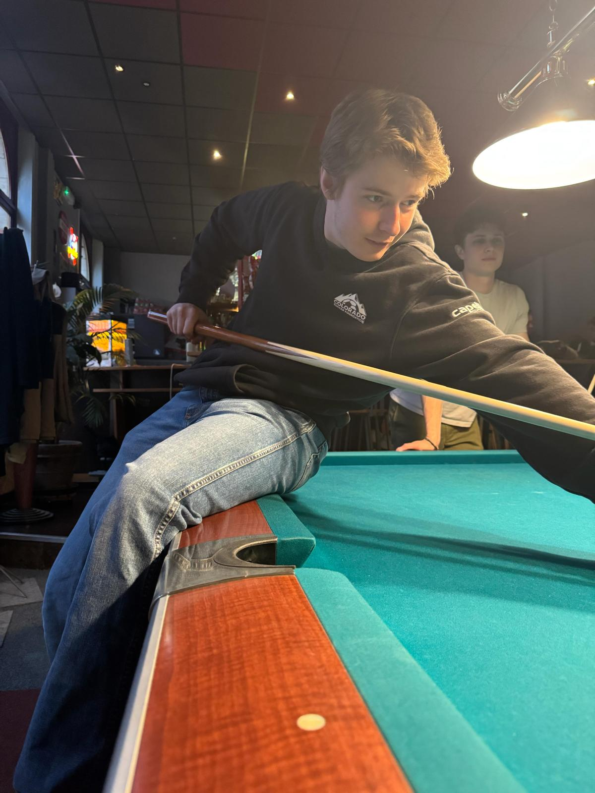

## Phase 4 Contributions

### User Interface and Functionality
During phase 4 of our project, we focussed on implementing the remaining functionality and ML models in our app. Primarily, this involved implementing the functionality for the Budget Manager persona which was not yet implemented. I took the lead on implementing the user interface and features for the persona such as a page to view stats about specific universities, and the ability to save budgets for universities to the database. In partnership with Bina, we were able to implement a ML model to calculate suggested budget allocations within universities based on the labor statistics related to which sectors needed more or less graduates to join the labor force.

Beyond the Budget Manager persona, I assisted Tyler and Alyssa in implementing the remaining features for the Student persona such as the Pros and Cons list, sorting favorited universities, and refining the model. Lastly, I took the lead on customizing the streamlit user interface, changing the app to dark mode and implementing the rotating title on the home screen.

### Database
In this phase, I made a variety of changes and additions to our database. Most notably, I clean and trimmed the extensive ETER database using a python script, and used another python script to generate insert statements for our academic_reports table based on this trimmed ETER database. I then used this data to populate fields in the Budget Manager pages about university statistics. 

### Git
This phase, I continued the role of managing our GitHub repository. I took the lead on resolving merge conflicts, testing, and approving PRs. There were moments where everyone was working together on separate branches which caused a variety of merge conflicts, but I found these cases helpful because it allowed me to deep-dive into the code which my teammates wrote and understand better how the app works as a whole. I was also able to identify and fix many issues before they were merged that would have otherwise broken our main branch. Overall, I am very grateful to have learned a lot about GitHub and version control as these are essential skills in the workforce.

## Week 4 Adventures
This week, in addition to completing our project, we went on a variety of excursions as a group. In Brussels, we visited a chocolate factory and learned about what makes Belgian Chocolate so special. We also explored an old coal mine in Genk which is now a tourist attraction called C-Mine and learned about Belgium's mining history and the working conditions of the miners in the mines. In Leuven, we participated in many group-building activities such as an escape room, pizza dinner, and many smaller group excursions throughout the city. For example, a few friends and I discovered a casual billiards hall which we have visited a few times in our free time. Overall, I am very grateful for the people I've met and friends I've made on this Dialogue, and I look forward to keeping in contact with them back in Boston.

*Cafe in Brussels Centraal*

*Mining Tower at C-Mine*

*View Overlooking Genk*

*Billiards*