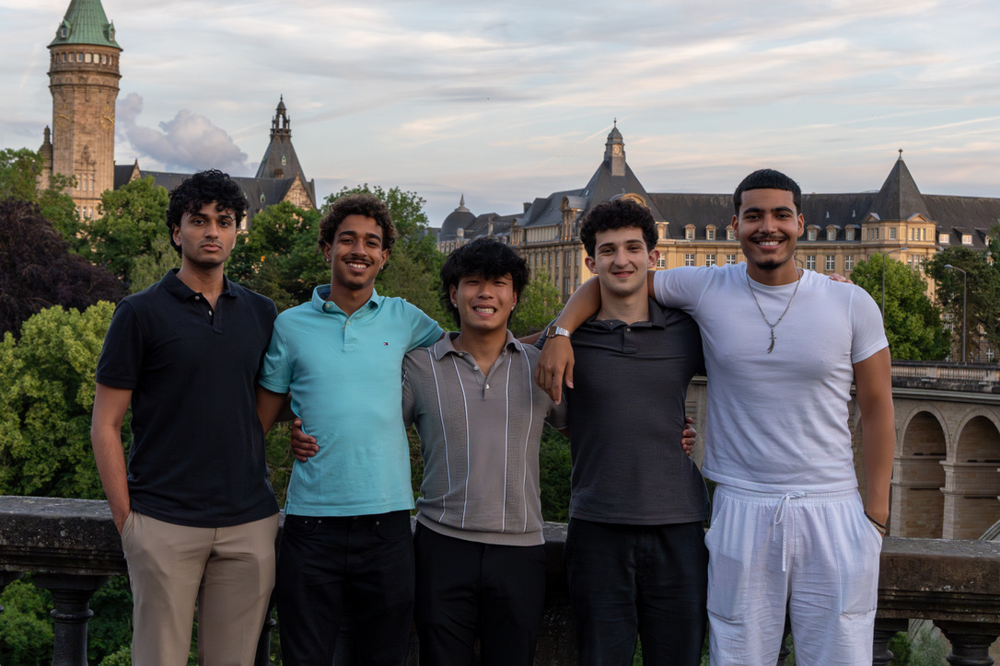
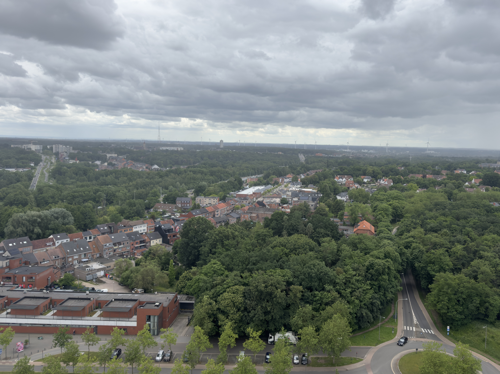
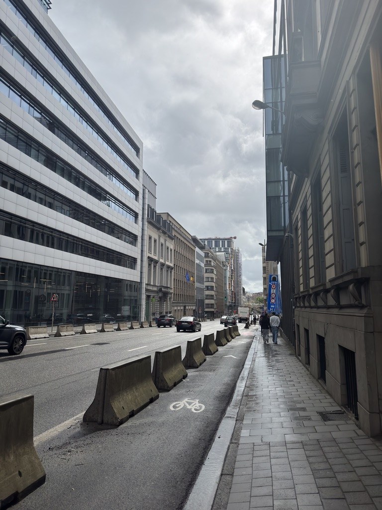

## Phase 4 Contributions

---

### Favorites
Throughout our Phase IV implementation of this project, one of the personas I most contributed to was our Student persona. One of the things I added was allowing students to favorite universities from their personalized list. Students now have the ability to favorite and unfavorite universities, and sort by several factors to organize their list.

### Pros and Cons
Another aspect of the student page I built was adding a pros and cons feature, allowing students to write pros and cons about each university in their listing. Students can write pros and cons, edit pros and cons, and add new pros and cons. 

### User Editability
While working on our project, I noticed user's were lacking the ability to change their information, so I decided to implement it. All three of our user personas now have the ability to change and update their information, including address, name, major (students), email, and more. This is all done through their user portal, which takes input and stores it into our database. 

### Labor Statistician UI
After adding the ability for Labor Statitian users to change their information, I noticed the information on our pages were too cluttered. User's had to scroll down in order to view their charts, making it confusing to operate and overall less appealing. To fix the issue, I built a whole new page that hosts our charts, allowing users to move between the pages, either through the sidebar, or using a single button within our page, making it much easier to navigate and overall more appealing.

### README File
In order for users to actually use our application, I created a README with thorough instructions on how to operate our repository. This includes actions such as cloning our repo, setting up docker containers to run our application, how to open it in a browser, and more. I also included a brief summary of what our application does, how each user persona works, and what contributions each developer had. 

### Routes
Lastly, I helped develop the rest of our API layer, creating more routes to allow the frontend to communicate with the backend. We use this layer so that the frontend never connects directly to the backend, giving us the flexibility to change our frontend from streamlit to something like react if that's what we see is best for the future. The routes I added mainly related to labor statistician and budget manager information. I added several get, post, put, and delete routes for those user personas.

## Week 4 Adventures

---

During my time in Leuven, while working on my page, I've had the opportunity to experience a lot of cool, new things. One of the trips I loved most was our visit to the C-Mine Mueseum in Genk. I loved learning about how mining worked back and then and seeing how they've changed the place since. Seeing the integration of new technology was fascinating, even though coal hasn't been mined since the late 1900s. Another activity that I enjoyed a lot was our trip to the escape room. Although we didn't escape in time 😔, I really enjoyed deepening my connection with my teamates and found it overall very fulfilling.

## Overall Takeaway

---

As our study abroad program is coming to an end, I've taken the time to reflect on all the experiences I've had and the knowledge I've learned throughout this time. Though at times hard, learning about relational databases, ml models, and building a full tech-stack application have helped me build my computer science wisdom and become a better developer overall. Taking a step back has made me understand how truly lucky I am to experience a trip like this. The people I've met and the places I've been to will all be something I will remember for the rest of my life. 

## Pictures

---

