# User Persona Updates

## Student
Since phase 1, we have narrowly defined the features available to the student persona. They will be able to take a survey which will suggest them universities that match their preferences. They will also be able to create pros/cons lists for each university which are saved to the database. Lastly, they will be able to favorite universities which is stored in the database. This database will be used to inform the models used by the labor statistician and budget manager personas.

## Cher Lemieux, Labor Statistician in the European Union
Since phase 1, we have specified the labor statistician user persona. We have narrowed the persona's features to include stats and predictions based on student users' specified majors and their implications on the work-force. We have also discussed having a chat-board platform for labor statisticians to discuss statistics and predictions with each other. We have not included this in our database design yet as we are still planning it out.

## Budget Manager
Since phase 1, we have more clearly defined the budget manager user persona. This persona's features will include a budget simulation tool to experiment with and explore predicted outcomes of different budget allocations between universities. Budget managers will be able to create plans and save them to the database for future reference. They will also be able to explore statistics related to students' favorited universities and how that may affect future student populations.

# ER Diagrams and Relational Models

## User Personal - Student
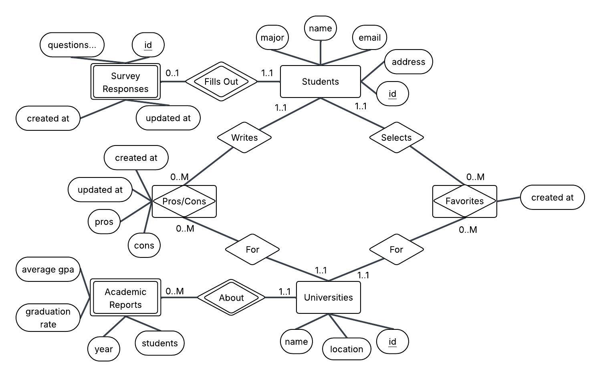


### Description
When students create their account they are asked for this basic information (name, email, major, address). This is then stored in the database and used throughout the app such as by informing the *Labor Statistician* persona about trending majors. While the student interacts with the app, they are able to favorite universities which then informs the *Budget Manager* persona about trending universities. Students are also able to view university statistics and make pros/cons lists for each university.

### Relationships and Cardinalities
Students are only able to fill out one survey and edit responses later. They are able to favorite any university as well as create pros/cons lists for any university. Universities can have multiple academic reports for each year, but academic reports can only be associated with one university. Survey responses are a weak entity because they are reliant on the student entity. Academic reports are a weak entity because they are reliant on the university entity. Favorites and Pros/Cons are associative entities because they represent a multiple-to-multiple relationship between students and universities.

## User Personal - Labor
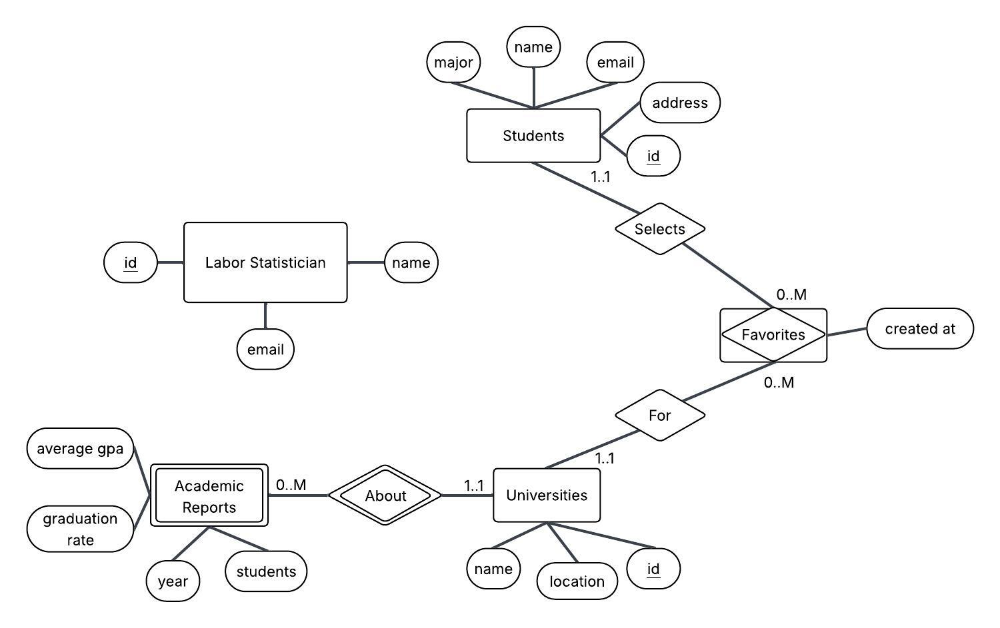
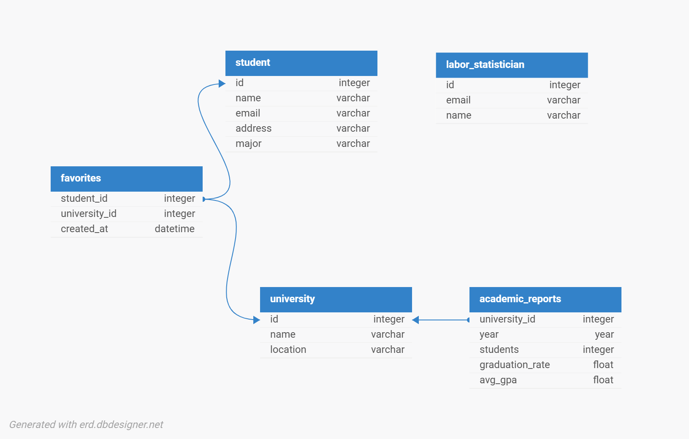

### Description
Labor statisticians are able to view statistics and data about academic performance, as well as seeing which majors are trending to inform potential implications for the labor sector.

### Relationships and Cardinalities
Universities are able to be liked by any user. The relationship between universities and academic reports is described above.

## User Personal - Budget
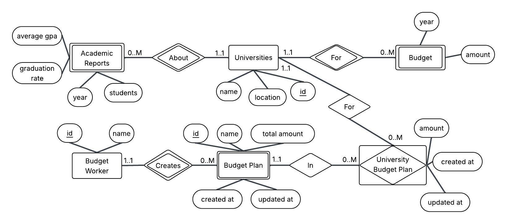
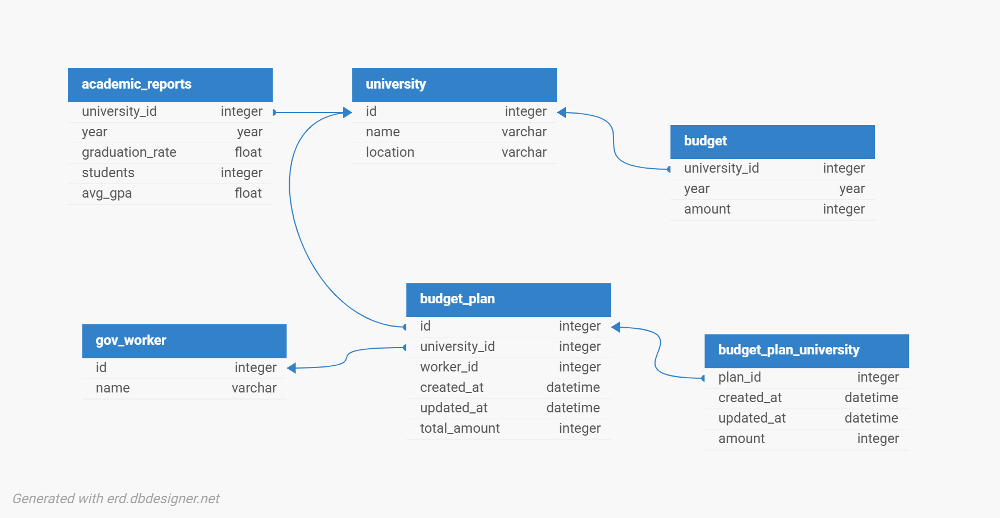

### Description
Budget managers are able to view statistics and data related to historical academic reports as well as historical budgets for each university. They are also able to create budget plans for groups of universities and simulate how they will perform based on historical data.

### Relationships and Cardinalities
Budget workers are able to create multiple budget plans. Each budget plan can have multiple university budget plans included within them. University budget plans are linked with a singular university. Historical university budgets are linked to a singular university, while any university can have multiple historical budgets. Budget plans are a weak entity because they are reliant on the government worker that created them. Budgets are a weak entity because they are reliant on the university that it is related to. University budget plans are an associative entity because they represent a many-to-many relationship between budget plans and universities.

## User Personal - Global
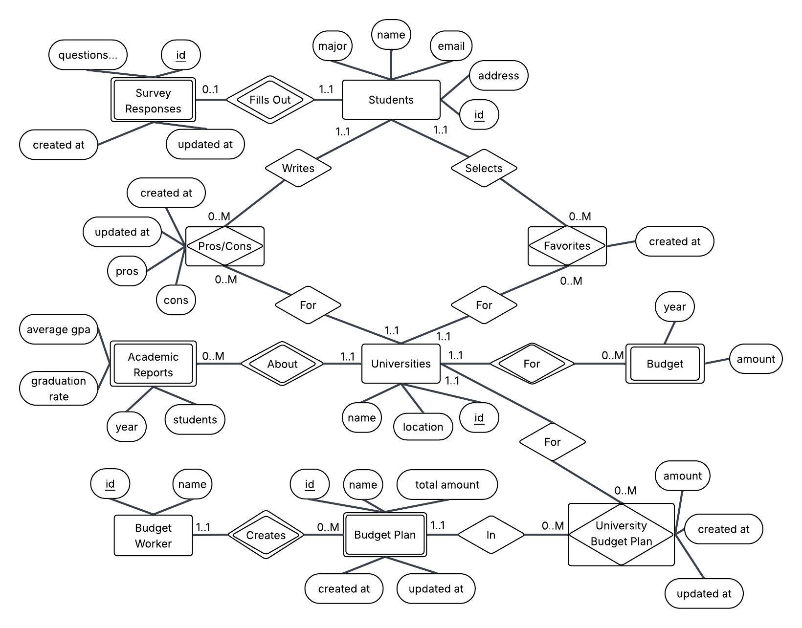
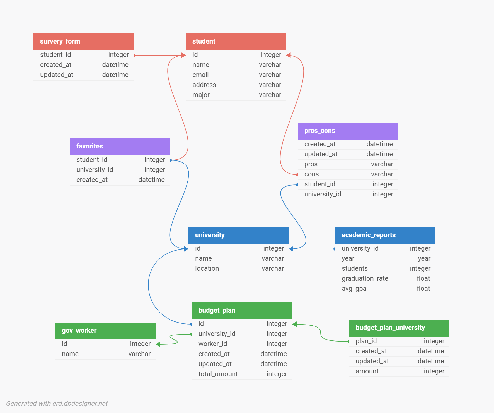

# Global DDL

```sql
CREATE TABLE student (
    id          INTEGER PRIMARY KEY,
    name        VARCHAR(100) NOT NULL,
    email       VARCHAR(100) NOT NULL,
    address     VARCHAR(255),
    major       VARCHAR(100)
);

CREATE TABLE university (
    id          INTEGER PRIMARY KEY,
    name        VARCHAR(100) NOT NULL,
    location    VARCHAR(255)
);

CREATE TABLE gov_worker (
    id          INTEGER PRIMARY KEY,
    name        VARCHAR(100) NOT NULL
);

CREATE TABLE survery_form (
    student_id  INTEGER NOT NULL,
    created_at  DATETIME NOT NULL DEFAULT CURRENT_TIMESTAMP,
    updated_at  DATETIME NOT NULL DEFAULT CURRENT_TIMESTAMP,
    FOREIGN KEY (student_id) REFERENCES student(id)
);

CREATE TABLE favorites (
    student_id    INTEGER NOT NULL,
    university_id INTEGER NOT NULL,
    created_at    DATETIME NOT NULL DEFAULT CURRENT_TIMESTAMP,
    FOREIGN KEY (student_id)    REFERENCES student(id),
    FOREIGN KEY (university_id) REFERENCES university(id)
);

CREATE TABLE pros_cons (
    created_at    DATETIME NOT NULL DEFAULT CURRENT_TIMESTAMP,
    updated_at    DATETIME NOT NULL DEFAULT CURRENT_TIMESTAMP,
    pros          VARCHAR(10000),
    cons          VARCHAR(10000),
    student_id    INTEGER NOT NULL,
    university_id INTEGER NOT NULL,
    FOREIGN KEY (student_id)    REFERENCES student(id),
    FOREIGN KEY (university_id) REFERENCES university(id)
);

CREATE TABLE academic_reports (
    university_id   INTEGER NOT NULL,
    year            YEAR NOT NULL,
    students        INTEGER,
    graduation_rate FLOAT,
    avg_gpa         FLOAT,
    FOREIGN KEY (university_id) REFERENCES university(id)
);

CREATE TABLE budget_plan (
    id              INTEGER PRIMARY KEY,
    university_id   INTEGER NOT NULL,
    worker_id       INTEGER NOT NULL,
    created_at      DATETIME NOT NULL DEFAULT CURRENT_TIMESTAMP,
    updated_at      DATETIME NOT NULL DEFAULT CURRENT_TIMESTAMP,
    total_amount    INTEGER,
    FOREIGN KEY (university_id) REFERENCES university(id),
    FOREIGN KEY (worker_id)     REFERENCES gov_worker(id)
);

CREATE TABLE budget_plan_university (
    plan_id     INTEGER NOT NULL,
    created_at  DATETIME NOT NULL DEFAULT CURRENT_TIMESTAMP,
    updated_at  DATETIME NOT NULL DEFAULT CURRENT_TIMESTAMP,
    amount      INTEGER,
    FOREIGN KEY (plan_id) REFERENCES budget_plan(id)
);
```

### Description of Datatypes

For the datatypes of values in our database, we chose to use varchars for all text and integers for IDs. For short fields such as names and emails, we set a limit of 100 characters. For medium length text such as address and location, we set a limit of 225. For long text such as the pros and cons fields, we set a limit of 10000 characters. Our IDs will be integers that iterate for each value. For created_at and updated_at, we use datetimes to track when fields are edited. Lastly, for decimal values such as GPA and graduation rate, we use floats rather than decimals as they do not need to be exactly precise.

# Wireframes

### Description

We used "Good Notes" to illustrate our wireframes for our application. This allowed us to quickly and efficiently outline page layouts and create key UI components for each user persona. We made three seperate portal designs, one for the Student, Labor Statistician, and Budget Manager. Each portal contains multiple interactive pages that provide the user a clean workflow. The sketches include elements such as data tables and charts to give a visual reference for how the application should look and behave once implemented.
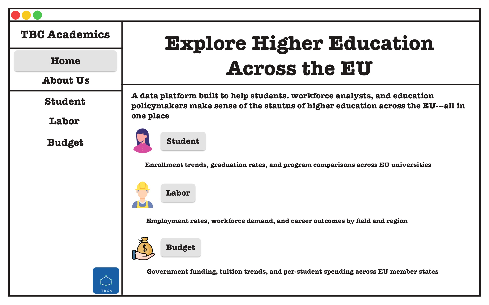
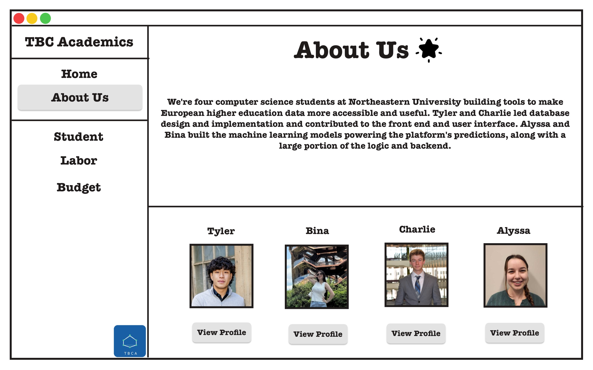
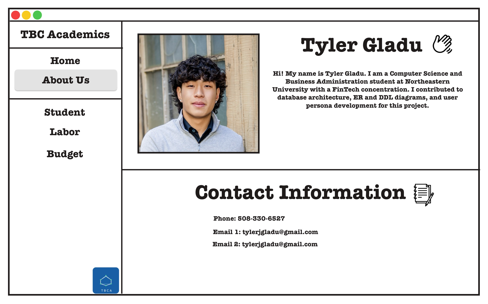
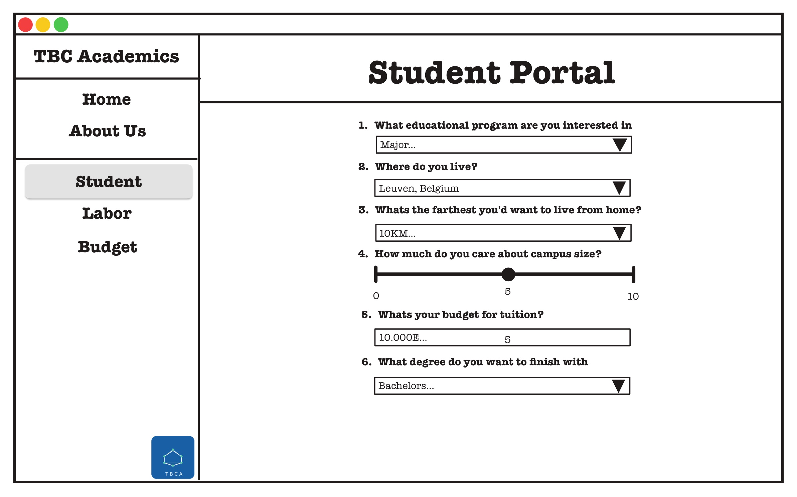
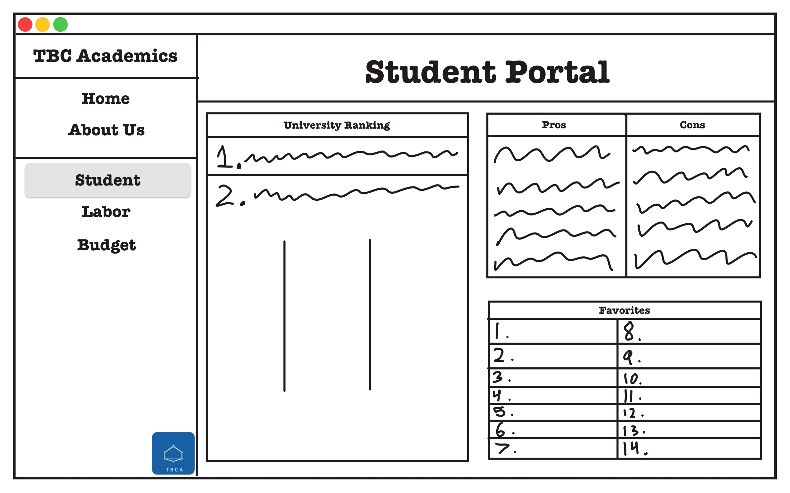
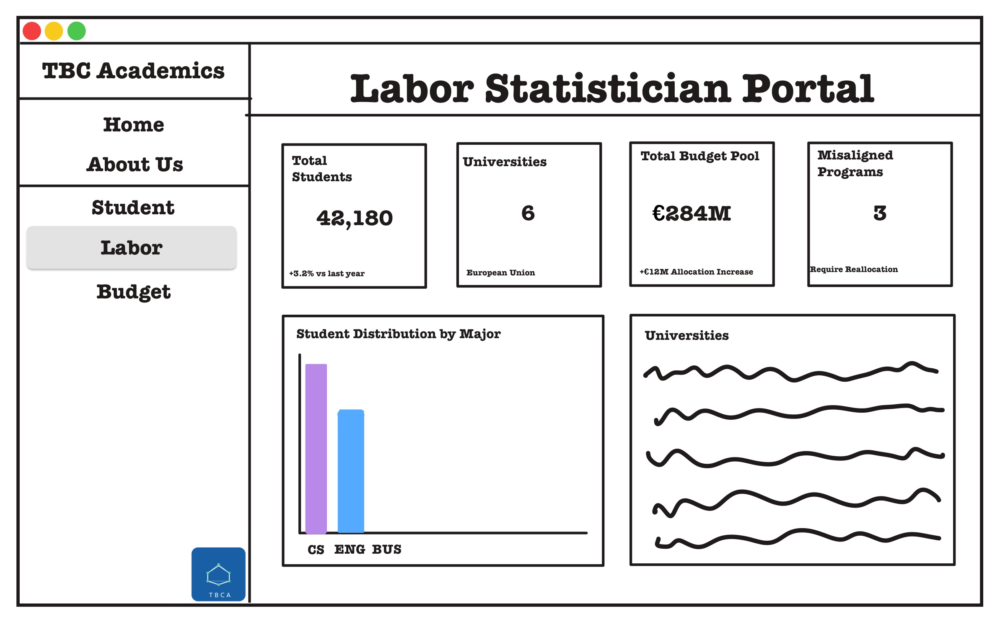
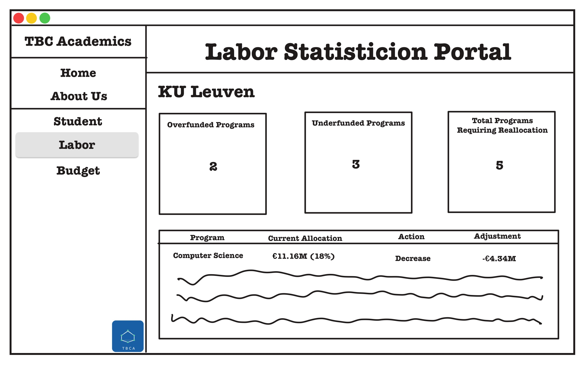
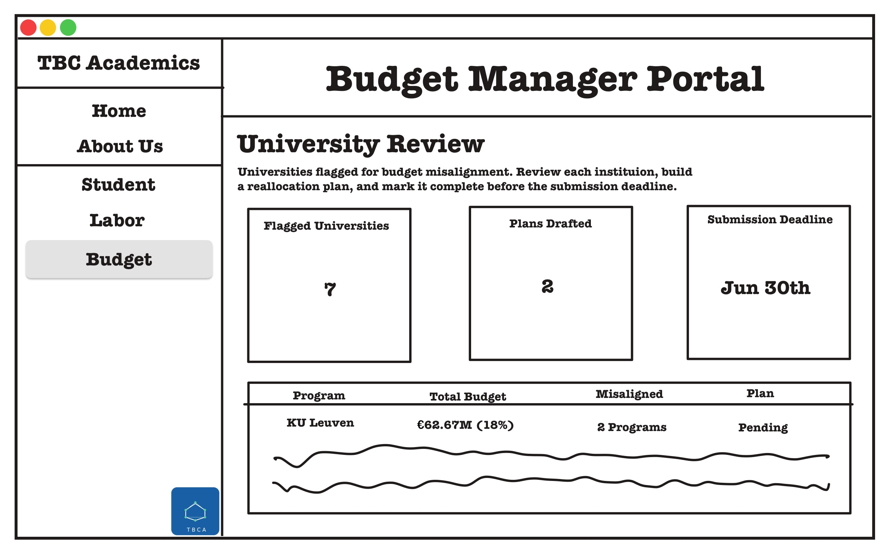
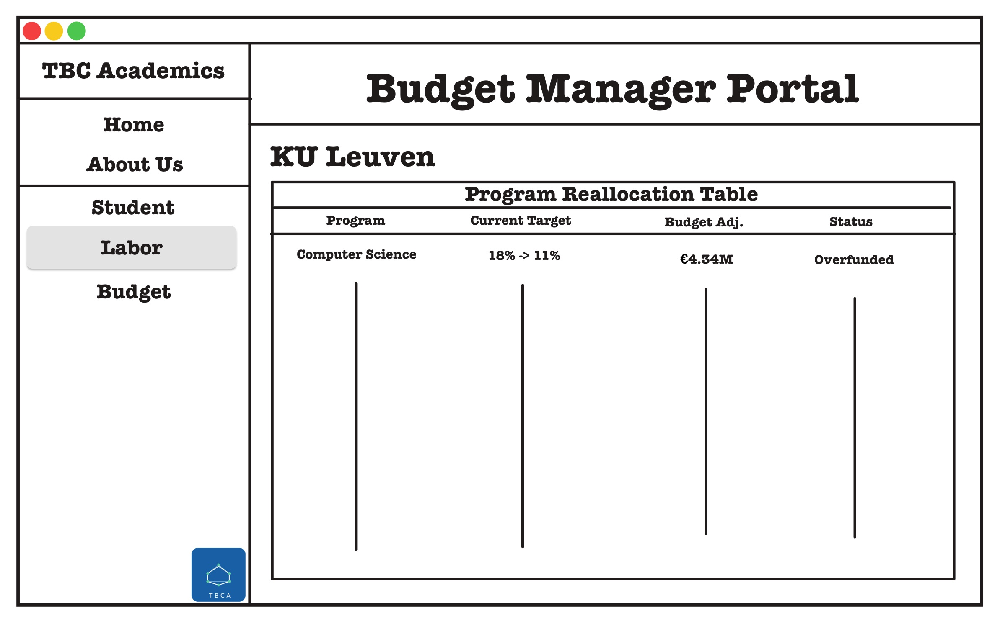

# Data Science: Labor Statistician Persona

## Data Collection

Two datasets were pulled directly from the Eurostat API using the same `get_json` function from class:

- **Employment by sector** (`nama_10_a64_e`): thousands of employed persons by NACE economic sector, country, and year across all 27 EU member states from 2010–2023
- **Graduates by field of study** (`educ_uoe_grad02`): number of tertiary graduates by ISCED field of education, country, and year

The two datasets use different classification systems, employment uses short NACE codes like `"J"` for ICT, graduates use full field names like `"Information and communication technologies"` so a crosswalk dictionary was built to map each education field to its primary labor market destination sector before merging.

## Visualizations

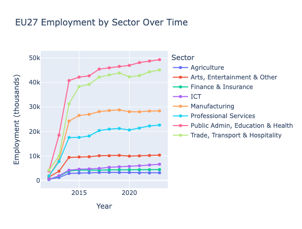
Public Admin, Education & Health is the largest and fastest-growing sector. ICT shows consistent growth across the entire period.

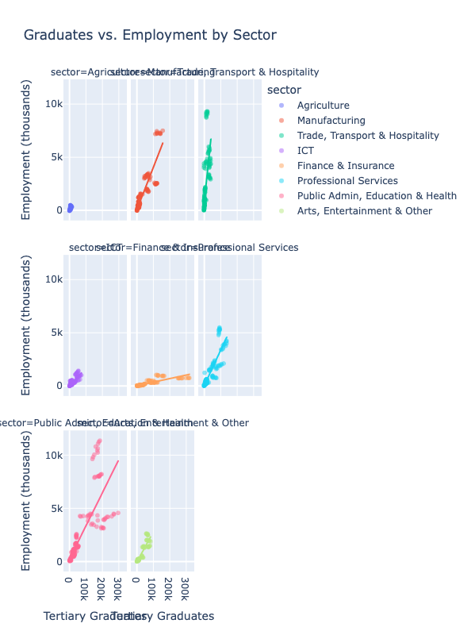
Each panel shows the relationship between graduate counts and employment for one sector with an OLS trend line. Manufacturing and Public Health show strong positive relationships. ICT and Finance flatter, suggesting those sectors rely more on international hiring than domestic graduate supply.

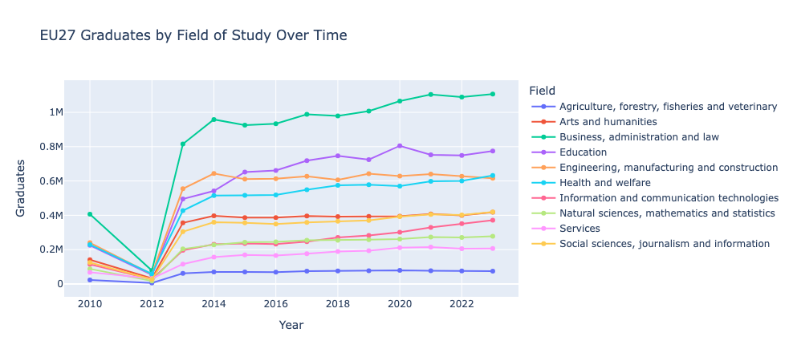
Business and law is the most common field. ICT graduates are growing but from a low base, consistent with the EU-wide tech skills shortage.

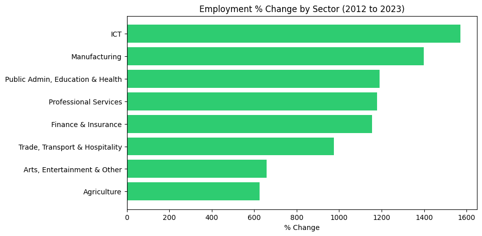
Every sector grew 2012–2023. ICT leads at ~1,560%, followed by Manufacturing at ~1,400%.

## ML Models

Both models use a temporal split; train on 2012–2020, test on 2021–2023 to simulate accurate forecasting.

**Model 1: Predicting Employment Level** (features: `time`, `graduates`)

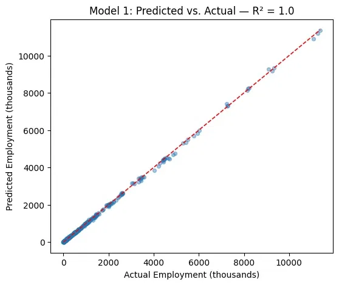

R² = 1.0, but this is misleading, employment is so stable year to year that the model essentially memorizes sector sizes from training. It systematically underpredicts large sectors.

**Model 2: Predicting Employment Change** (features: `time`, `graduates`, `employment_lag1`)

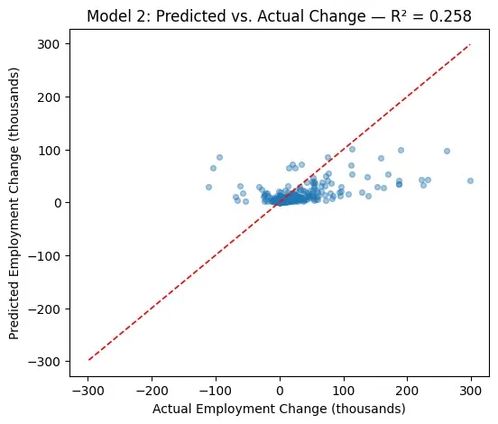

R² = 0.258. Predicting year-over-year change instead of the raw level forces the model to actually use graduate data to explain growth. Including last year's employment lets it predict both positive and negative changes.

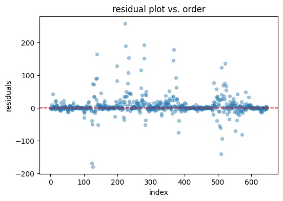

Residuals scatter randomly around zero, no systematic pattern, which is what we want.

**Germany: Actual vs. Predicted**

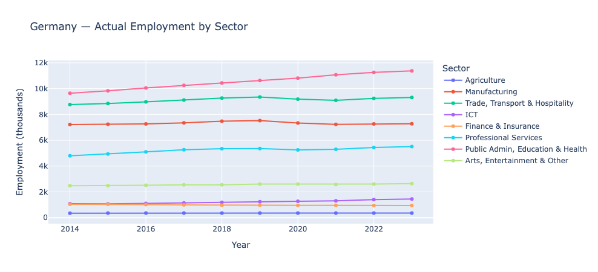
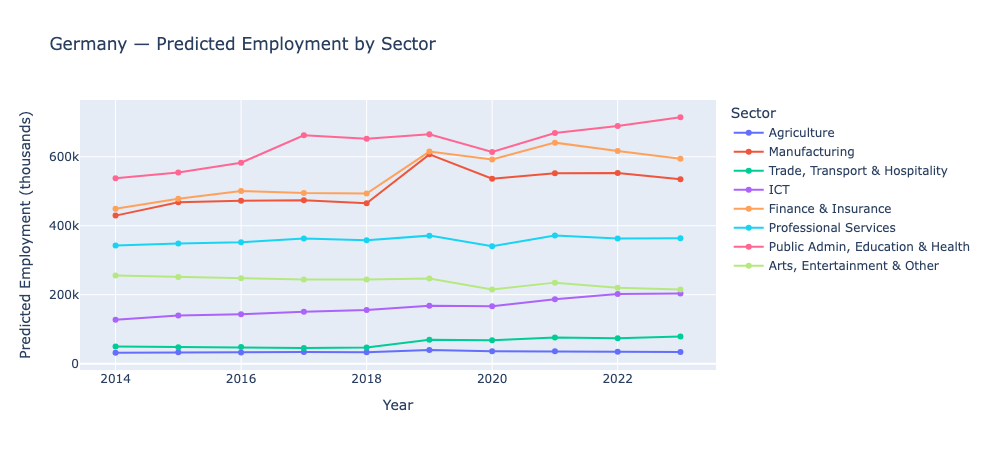

The predicted chart closely shows actual employment by sector, confirming the model tracks real patterns well at the country level.

## Model Discussion

We built two linear regression models using employment and graduate data pulled from Eurostat across all 27 EU member states from 2012–2023, trained on 2012–2020 and tested on 2021–2023.

Model 1 predicts raw employment level using graduates and year. R² = 1.0, but only because employment barely changes year to year, the model is memorizing sector sizes, not learning from graduate data. Model 2 predicts employment change using graduates, year, and last year's employment. R² = 0.258, meaning our features explain about 26% of employment growth.

Neither model is perfect. Employment is pushed by many things not in our data: recessions, policy, automation, immigration, COVID-19. What these models show is that graduate supply has a measurable relationship with sector employment growth across the EU, which is directly useful for the labor statistician persona when monitoring whether the graduate pipeline is keeping up with sector demand.

For our visualizations, we chose line charts to show employment and graduate trends over time since they make it easy to compare how multiple sectors move relative to each other across years. Scatter plots with OLS trend lines were used to  answer our big question: does graduate supply relate to employment in that sector, since the trend line makes the direction and strength of the relationship visible. The horizontal bar chart was chosen for the percent change comparison because it makes it easy to rank sectors.

For Phase III, the main tasks remaining are connecting the model to a REST API so the labor statistician persona can query predictions interactively, editing Model 2 with additional features to push the R² beyond 0.258, and deploying both models in a Docker container. The biggest difficulty in Phase II was that the two Eurostat datasets use completely different classification systems; NACE codes for employment and ISCED field names for graduates which required building a manual crosswalk and  merging before any modeling could happen.

# Data Science: Student Persona

## Data Collection

There were two datasets that were pulled from two sources. The first from ETER database where I downloaded the data as an excel file and transformed it to a csv format. The second was an open source api of which the data I saved as a csv.

- **Hipo University Domains List** (`eu_universities`): universities worldwide which i filtered to save in a csv of only the EU country universities. Includes the university names, domains, and web pages.
- **ETER Data** (`University_budget_stats or University_bs`): university data on student fees highest degree offered, city, staff amount.

The two datasets were merged on the university English name column (`BAS.INSTNAMEENGL` in ETER, `name` in Hipo) to merge the ETER feature data with the Hipo website links into a single dataframe.

## Visualizations


Public Admin, Education & Health is the largest and fastest-growing sector. ICT shows consistent growth across the entire period.


Each panel shows the relationship between graduate counts and employment for one sector with an OLS trend line. Manufacturing and Public Health show strong positive relationships. ICT and Finance flatter, suggesting those sectors rely more on international hiring than domestic graduate supply.


Business and law is the most common field. ICT graduates are growing but from a low base, consistent with the EU-wide tech skills shortage.


Every sector grew 2012–2023. ICT leads at ~1,560%, followed by Manufacturing at ~1,400%.

## ML Models

Both models use a temporal split; train on 2012–2020, test on 2021–2023 to simulate accurate forecasting.

**Model 1: Predicting Employment Level** (features: `time`, `graduates`)


R² = 1.0, but this is misleading, employment is so stable year to year that the model essentially memorizes sector sizes from training. It systematically underpredicts large sectors.

**Model 2: Predicting Employment Change** (features: `time`, `graduates`, `employment_lag1`)


R² = 0.258. Predicting year-over-year change instead of the raw level forces the model to actually use graduate data to explain growth. Including last year's employment lets it predict both positive and negative changes.


Residuals scatter randomly around zero, no systematic pattern, which is what we want.

**Germany: Actual vs. Predicted**


The predicted chart closely shows actual employment by sector, confirming the model tracks real patterns well at the country level.

## Model Discussion

We built two linear regression models using employment and graduate data pulled from Eurostat across all 27 EU member states from 2012–2023, trained on 2012–2020 and tested on 2021–2023.

Model 1 predicts raw employment level using graduates and year. R² = 1.0, but only because employment barely changes year to year, the model is memorizing sector sizes, not learning from graduate data. Model 2 predicts employment change using graduates, year, and last year's employment. R² = 0.258, meaning our features explain about 26% of employment growth.

Neither model is perfect. Employment is pushed by many things not in our data: recessions, policy, automation, immigration, COVID-19. What these models show is that graduate supply has a measurable relationship with sector employment growth across the EU, which is directly useful for the labor statistician persona when monitoring whether the graduate pipeline is keeping up with sector demand.

For our visualizations, we chose line charts to show employment and graduate trends over time since they make it easy to compare how multiple sectors move relative to each other across years. Scatter plots with OLS trend lines were used to  answer our big question: does graduate supply relate to employment in that sector, since the trend line makes the direction and strength of the relationship visible. The horizontal bar chart was chosen for the percent change comparison because it makes it easy to rank sectors.

For Phase III, the main tasks remaining are connecting the model to a REST API so the labor statistician persona can query predictions interactively, editing Model 2 with additional features to push the R² beyond 0.258, and deploying both models in a Docker container. The biggest difficulty in Phase II was that the two Eurostat datasets use completely different classification systems; NACE codes for employment and ISCED field names for graduates which required building a manual crosswalk and  merging before any modeling could happen.