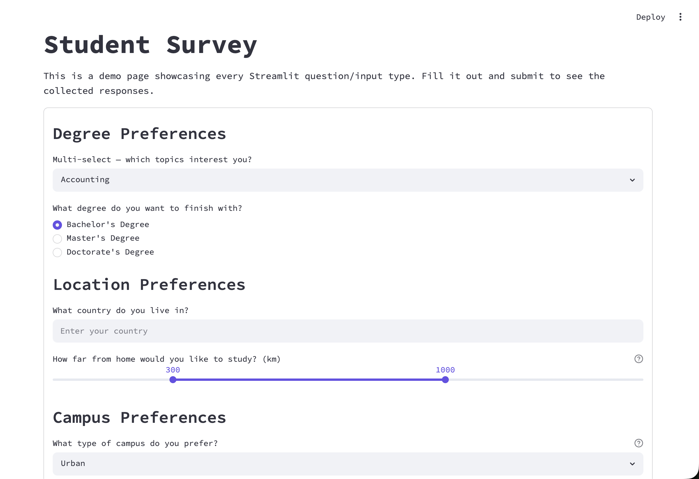
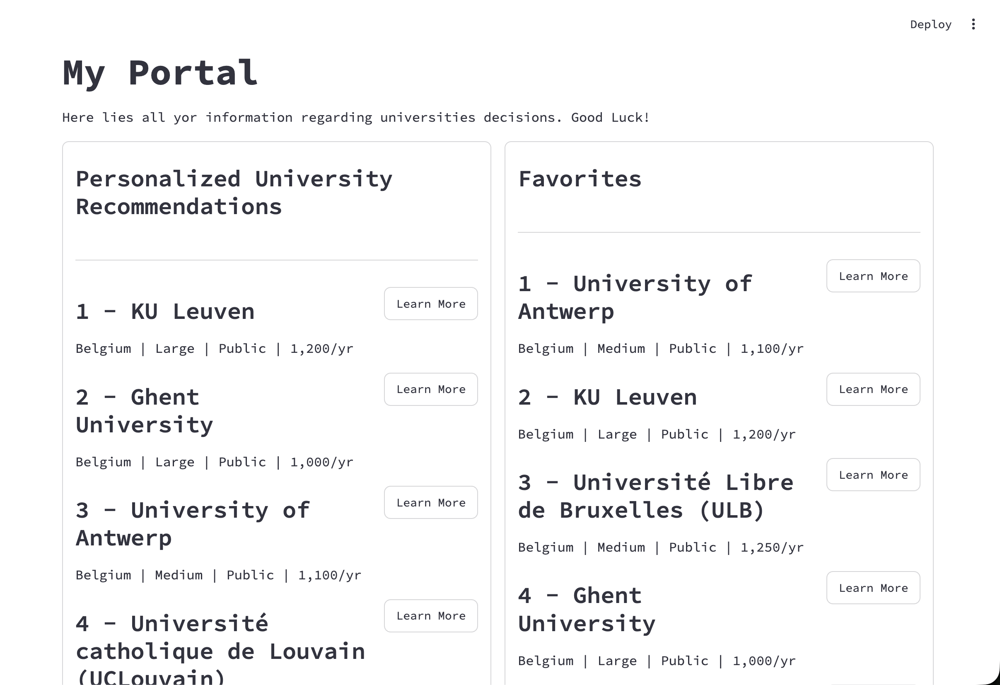
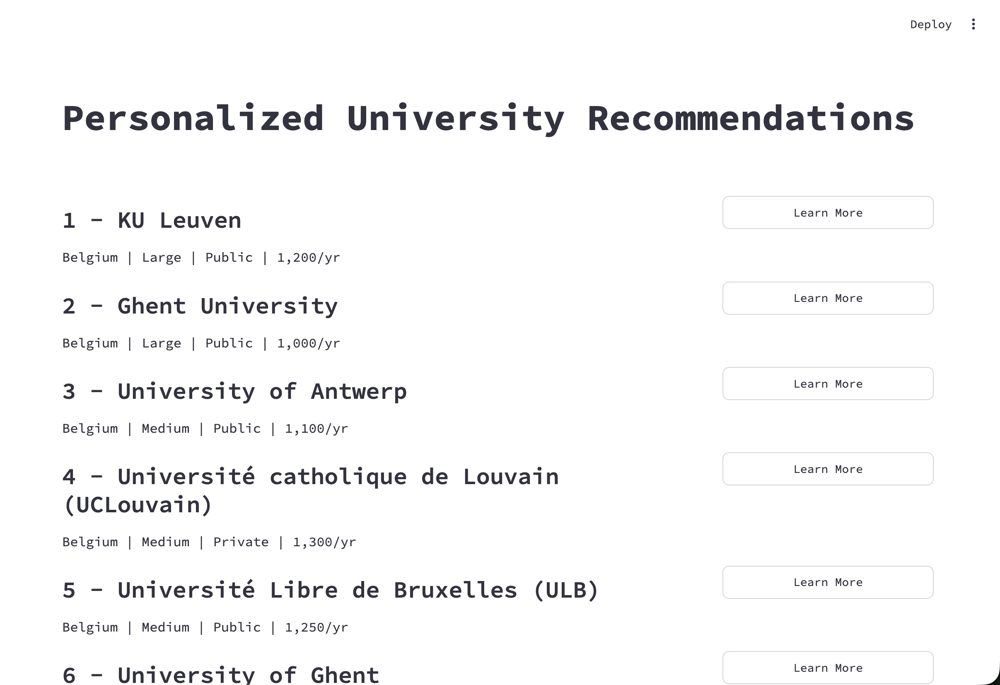
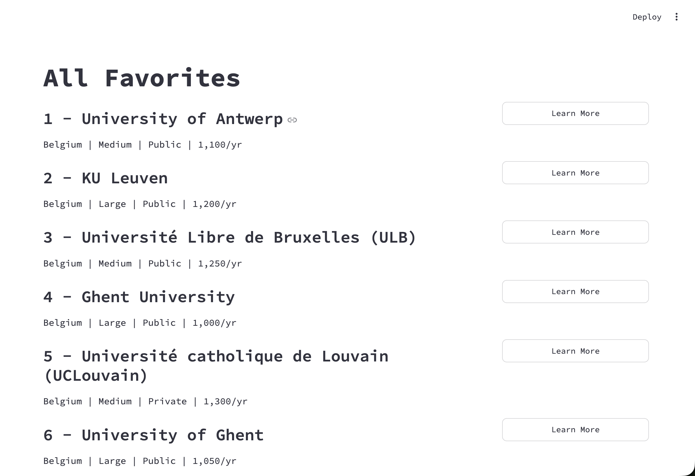
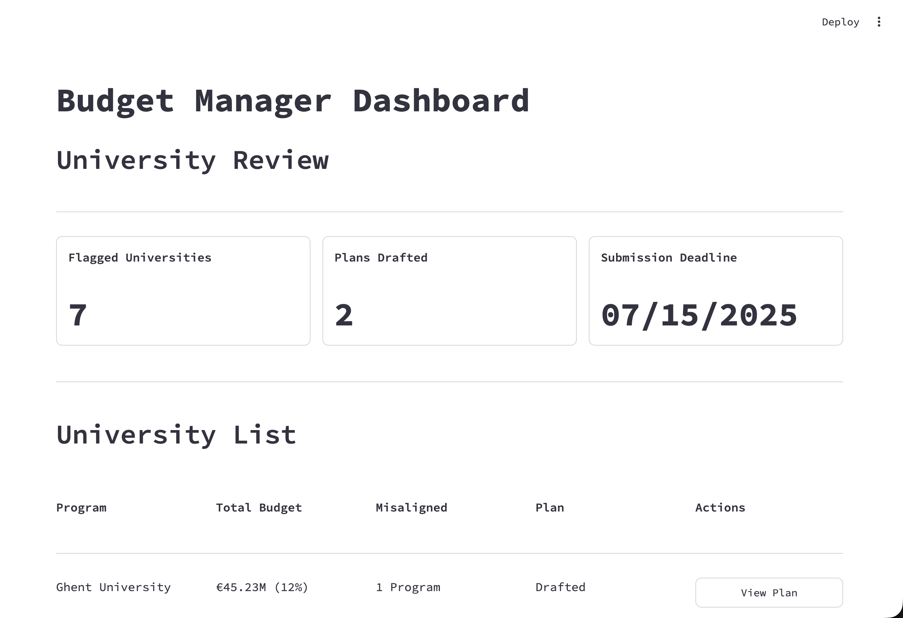
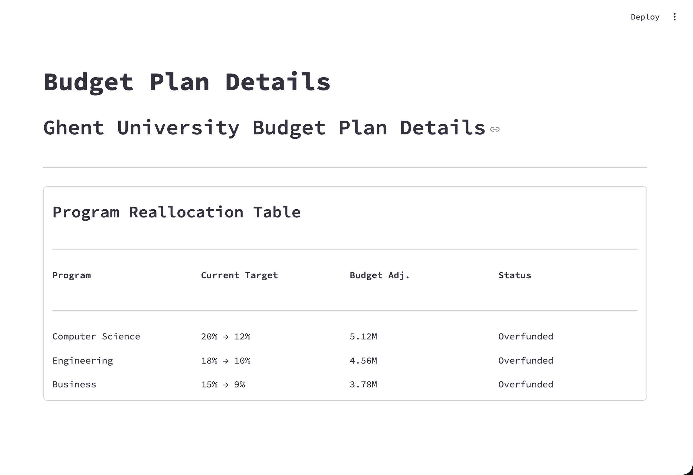

## Updates Since Phase 2

### Updates to Data Model
Since phase 2, we have added minor updates to our data model:
- **Add labor_statistician entity:** Due to the requirements to store mock data about all three user personas, we added a simple labor_statistician entity. This entity contains an id, first_name, last_name, and email. This will allow us to add functionality to save stats, and other features.
- **Separate name attributes into first_name and last_name:** We realized that different parts of our site may only need the first name, so rather than splitting the name attribute, we decided it would be easier to simply store the first and last name separately.

## Routes

### REST API Matrix
To start planning our REST API, we used the functionality planned for in our wireframes to devise a list of routes needed in our app. Then listed these in this REST API Matrix along with the scenarios in which these routes will be used within the app.



#### Route Syntax Details
In creating our routes, we considered how to label the routes to make them the most understandable for those working with them. This included labeling them first by what was being access ('universities' and 'students'), and then narrowing to more specific info (such as specific stats). When specific entries had to be accessed, such as a specific student or university, we would simply include their id in the route (.../{id}). This differs from the syntax used when creating filters to filter out specific entries that had the same value such as stats about a specific university. This was done by including query parameters(...?id={id}).

### Implementing Routes
After theorizing routes in the REST API Matrix, we implemented them in python in our project's backend. This involved following the format provided in the syntax (cursor commands, try/except to catch errors, etc) and theorizing how the frontend would interact with the API and how the frontend would need data to be presented. One specific example of this was the route for a student to favorite/unfavorite a university. In our UI, this would likely look like a "like" button that would be toggled on and off. Hence, rather than splitting the function ran when the button is selected into three routes (check if university is favorited, if it isn't POST a new relation row, if it is DELETE that relation row), we decided it would be easier to call a single route and have the API do the work under the hood. Hence, when the frontend calls *POST /favorites/{student_id}/{university_id}*, the API does all this under the hood. This route looks as follows:

```python
@university_explorer_routes.route(
    "/favorites/<int:student_id>/<int:university_id>", methods=["POST"])
def toggle_favorite(student_id, university_id):
    """Toggle a favorite for a student
    If the favorited row exists in the table it deletes it.
    If the favorited row does not exist in the table it creates it.
    """
    current_app.logger.info(f"POST /favorites/{student_id}/{university_id}")
    try:
        db = get_db()
        cursor = db.cursor()
        # First queries for the favorite to see whether it already exists
        cursor.execute(
            """SELECT 1
                 FROM favorites
                WHERE student_id = %s AND university_id = %s""",
            (student_id, university_id),
        )
        exists = cursor.fetchone() is not None

        if exists:
            # If the row exists, remove it
            cursor.execute(
                """DELETE FROM favorites
                    WHERE student_id = %s AND university_id = %s""",
                (student_id, university_id),
            )
            db.commit()
            return jsonify({"favorited": False}), 200

        # If the row doesn't exist, add it
        cursor.execute(
            "INSERT INTO favorites (student_id, university_id) VALUES (%s, %s)",
            (student_id, university_id),
        )
        db.commit()
        return jsonify({"favorited": True}), 200
    except Error as e:
        current_app.logger.error(f"POST favorite toggle failed: {e}")
        return error_response("Could not toggle favorite", 400)
```

## Data Model Updates
 
We added the following tables since Phase II:
 
- labor_observations: (**sourced**) 2,354 rows of cleaned Eurostat data (employment by sector, graduates by field, working-age population) across EU27, 2013–2023
- model1_params: (**generated**) trained weights for the employment level prediction model
- model2_params: (**generated**) trained weights for the employment change prediction model
- labor_statistician: (**generated**) mock user data for the labor statistician persona

## ML Features
 
**Model 1 — Employment Level**
Feature: last year's employment (employment_thousands_lag1). Employment is highly autocorrelated year over year, making the lag the strongest single predictor.
 
**Model 2 — Employment Change**
Features: graduates entering the sector, last year's employment, and year. Graduates measure supply-side pipeline pressure, the lag has the sector size and momentum, and year gets the long-run trends like ICT growth and agricultural decline across the EU.
 
## Surprising Issues
 
- Model 1 performed poorly when using only graduate counts, adding the employment lag resolved this, since graduates alone don't tell you how large a sector already is
- Model 2 R^2 was modest (~0.36), which makes sense: employment change is pushed by factors outside our data like recessions, policy, and COVID-19
- The 2020 data year is a visible outlier in several sectors due to COVID, which affected test performance
- Mapping Eurostat's graduate fields (ISCED) to employment sectors (NACE) required a manual crosswalk, an approximation that limits model precision

## REST API Matrix
 
| Method | Route | Description | User Story |
|--------|-------|-------------|------------|
| GET | `/labor/predict/level/<emp_lag1>` | Predict employment level | Statistician forecasts sector employment |
| GET | `/labor/predict/change/<graduates>/<emp_lag1>/<time>` | Predict employment change | Statistician checks if grad supply matches demand |
| GET | `/labor/observations` | All labor observations | Populate charts |
| GET | `/labor/observations/<geo>` | Filter by country | Specific country |
| GET | `/labor/sectors` | List sectors | Populate UI dropdowns |
| GET | `/labor/countries` | List countries | Populate UI dropdowns |
| GET | `/labor/absorption` | Absorption rate by sector | Show graduate surplus/deficit by sector |
| POST | `/labor/observations` | Add a data point | Admin adds new Eurostat data |
| PUT | `/labor/observations/<id>` | Update a data point | Admin corrects an error |
| DELETE | `/labor/observations/<id>` | Remove a data point | Admin removes a flagged row |
## User Interface



*Figure 1 - Student Survey*

#### Figure 1 Description
We created this page to allow a student user to input their personal preferences for university. Some of the options we included that are inputted into our ML model are budget, school size (Small, Medium, Large), and degree level (Bachelor's, Master's, or Doctorate's)

---



*Figure 2 - Student Portal Page (10 Universities & 5 Favorites)*

#### Figure 2 Description
The page above provides a student a personalized list of universities based on their preferences. Alongside it are a list of favorites that the user can choose and rank to keep track of which universities they would most like to go to.

---



*Figure 3 - Student Portal University List (100 Universities)*

#### Figure 3 Description
This page pulls up when a student clicks "View More" below their list of personalized universities. Our initial list only holds their top 10, but to allow students the flexibility to look at more pages, we added another page that shows their top 100 universities.

---



*Figure 4 - Student Portal Full Favorites List (All)*

#### Figure 4 Description
This page is similar to the previous one. When a student clicks on "View More" below their list of favorites, rather than only seeing their top 5 favorites, they're able to see all of their favorites and interact with them.

---



*Figure 5 - Budget Manager Portal*

#### Figure 5 Description
The page above is our intial budget manager portal. A budget manager is able to see a large amount of data including information such as flagged universities, budget plans drafted, and submission deadline for budget plans. They're also able to see a list of universities that have plans or need plans to be drafted.

---



*Figure 6 - Budget Manager Plan View*

#### Figure 6 Description
A budget manager is able to see a specific plan they have created for a university by clicking "View Plan" to the right of a specific university. They are provided a program reallocation table which shows data such as program name, current target, budget adjustment, and status of plan.


## ML Model - University Ranking Unsupervised Model
My main contribution this phase was taking the university ranking model from the Jupyter Notebook and converting it into a Python class that works with our Flask backend.

The model uses cosine similarity to rank EU universities based on three features from the student survey:
- **Student budget** - their tuition preference
- **Degree level** - Bachelors (1), Masters (2), Doctorate (3)
- **Campus size** - Small (1), Medium (2), Large (3)

These features were chosen because they directly map to what a student is looking for and we had matching data in our dataset. Staff FTE is used as a proxy for campus size since it correlates with how big the institution is. The model standardizes all features using StandardScaler, then computes cosine similarity between the student input vector and each university vector. Universities are ranked by score and returned as a dictionary keyed by rank.

### Changes from Phase 2 to Phase 3
- Converted the Jupyter Notebook into a `university_ranking_model` class in `modelrec.py`
- Updated the campus size formula from a 1-10 scale to 1-3 to match the updated survey question (Small/Medium/Large)
- Converted the cleaned model dataset (`model_df.csv`) into a SQL file (`02_modelrec.sql`) and loaded it into the `modelrec` table

### Routes
I wrote two routes in `modelrec_routes.py`:
- `GET /modelrec/predict/<budget>/<degree>/<size>` - returns top 10 matches
- `GET /modelrec/predict/all/<budget>/<degree>/<size>` - returns all ranked universities

### Frontend Pages (In Progress)
I am currently working on the student facing pages:
- `02_Student_Data.py` - the student portal showing personalized recommendations and favorites, pulling from the ML model route
- The survey page collects budget, degree level, and campus size and passes them through `st.session_state` to the portal page

### Surprising Issues
Something that took longer than expected was wiring the survey inputs into the portal page. The survey stores campus size as a string like "Small (<5,000 students)" so I had to map those back to numbers before passing them to the model. Same thing with degree level, it comes in as "Bachelor's Degree" and the model needs a 1, 2, or 3. Also the budget from the survey is just a raw number but Flask was expecting a float in the URL so I had to update the route to accept any number and cast it manually. There were a lot of small things that had to line up between the frontend and the model and every time I fixed one thing I realized I forgot to update something else connected to it. This is a surprise to me because I didn't realize how many little things and changes I miss all the time, and don't automatically think about. So that's something I also want to work on. Making sure to not forget about the little things when im so focused on the big picture.
